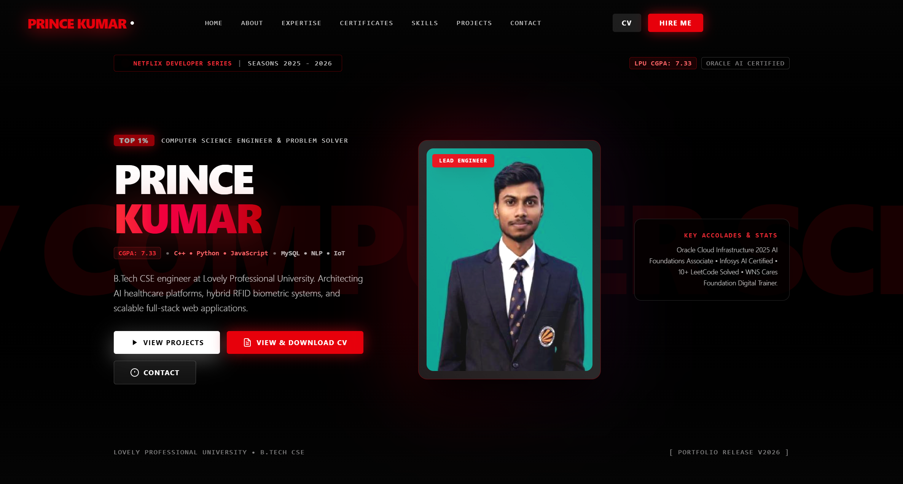
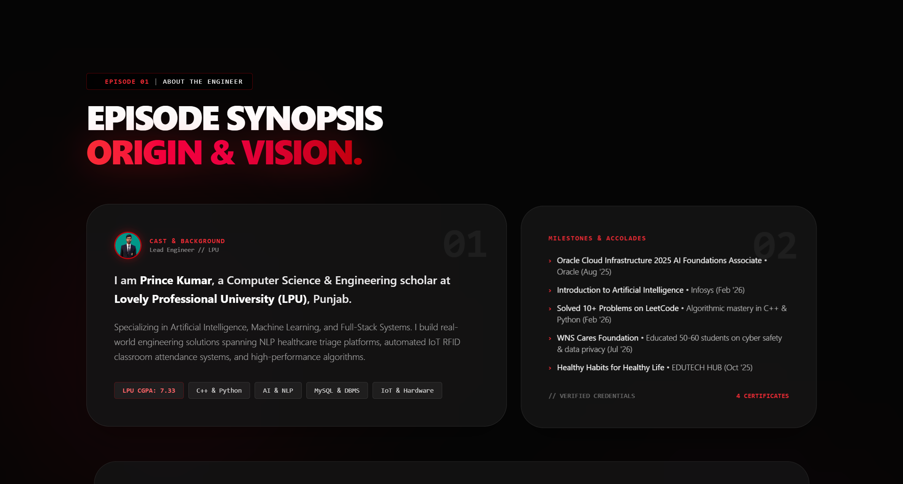
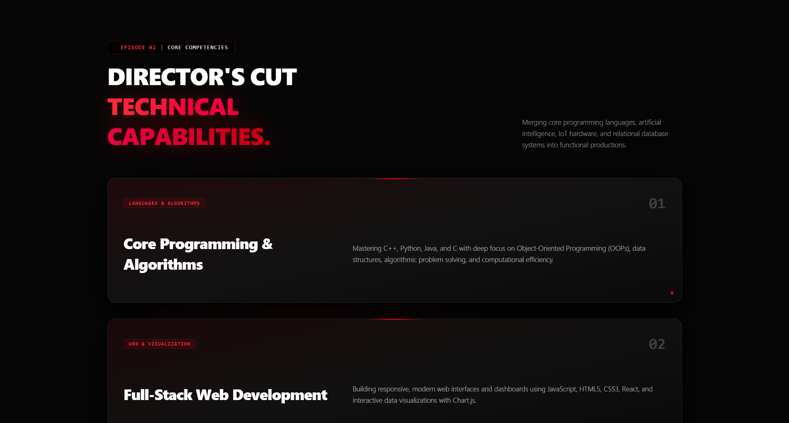
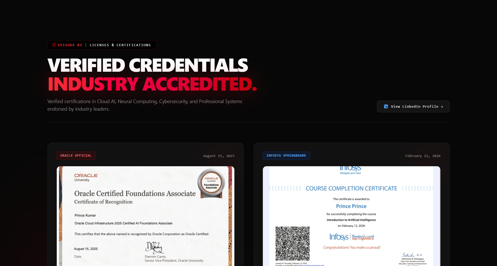
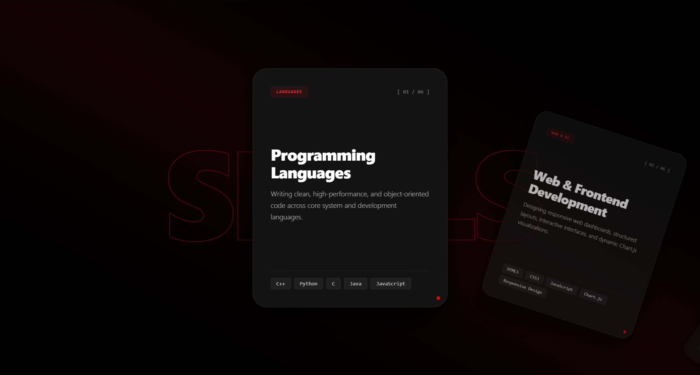
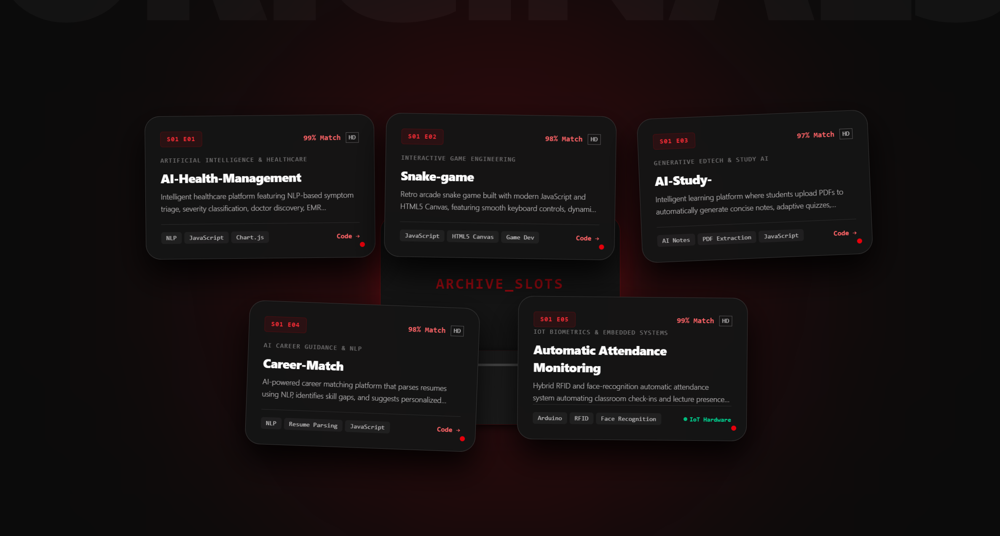
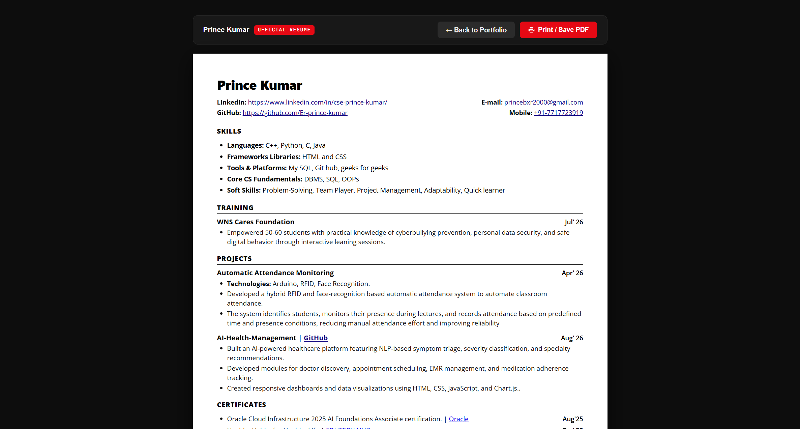
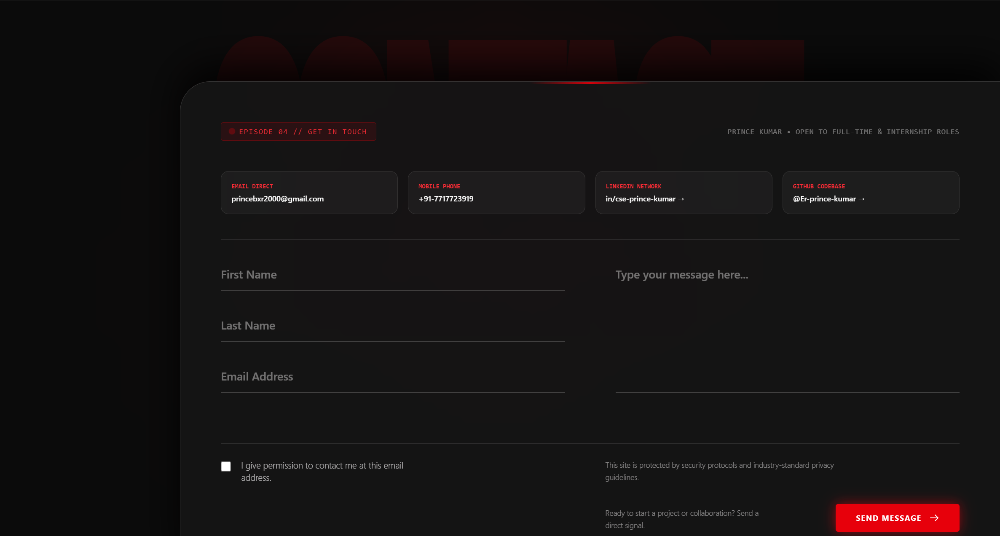

<div align="center">

# 🎬 Prince Kumar | Netflix Themed Developer Portfolio

### *An immersive, cinematic portfolio blending Netflix-inspired UI design with state-of-the-art web animations, AI productions, and systems engineering.*

<br/>

[](https://react.dev/)
[](https://vitejs.dev/)
[](https://tailwindcss.com/)
[](https://greensock.com/gsap/)
[](https://www.framer.com/motion/)
[](LICENSE)

<br/>

[🌟 Live Demo](https://github.com/Er-prince-kumar/Portfolio) • [📥 View CV](public/Prince_Kumar_CV.html) • [📬 Contact Me](mailto:princebxr2000@gmail.com) • [💼 LinkedIn](https://www.linkedin.com/in/cse-prince-kumar/)

---

</div>

## 📌 Table of Contents

- [Overview](#-overview)
- [Visual Experience & Screenshots](#-visual-experience--screenshots)
- [Key Features](#-key-features)
- [Featured Series & Projects](#-featured-series--projects)
- [Tech Stack](#-tech-stack)
- [Architecture & Folder Structure](#-architecture--folder-structure)
- [Getting Started](#-getting-started)
- [Environment & Deployment](#-environment--deployment)
- [Author & Contact](#-author--contact)
- [License](#-license)

---

## 🌟 Overview

Welcome to the **Official Cinematic Netflix Developer Portfolio** of **Prince Kumar** — Computer Science & Engineering undergraduate at **Lovely Professional University (LPU)**, AI researcher, Full-Stack developer, and IoT engineer.

Instead of a conventional static portfolio, this project reimagines personal branding as a **streaming entertainment experience**:
- Personal background presented as **Episodes & Seasons**.
- Technical skills curated into **Genres & Categories**.
- Software engineering works displayed as **Original Productions & Blockbusters**.
- Credentials and certifications formatted as **Verified Licenses**.
- Integrated **interactive resume modal**, dynamic audio-visual cues, and fluid mouse spotlight effects.

---

## 📸 Visual Experience & Screenshots

<div align="center">

### 1. 🍿 Cinematic Hero & Netflix Billboard
*Hero stage featuring Netflix typography, billboard trailer controls, dynamic match score, and custom cursor glow.*
<br/>


<br/><br/>

### 2. 👤 About Me (Bento Grid Series)
*Interactive Bento Grid showcasing background, engineering philosophy, and real-time mouse tracking spotlight.*
<br/>


<br/><br/>

### 3. ⚙️ Systems Architecture & Core Expertise
*High-level capabilities across AI triage, Full-Stack pipelines, relational DB design, and embedded IoT.*
<br/>


<br/><br/>

### 4. 📜 Industry-Accredited Certifications
*Verified credentials including Oracle Cloud AI, Infosys Springboard, WNS CyberSmart, and EduTech.*
<br/>


<br/><br/>

### 5. ⚡ Interactive Skills Matrix
*Organized technical skill cards with live focus states across Languages, UI, DBMS, and AI.*
<br/>


<br/><br/>

### 6. 🎬 Featured Productions (Projects Reel)
*Cinematic project showcase with dynamic 3D folder opening animations, episode tags, and GitHub repositories.*
<br/>


<br/><br/>

### 7. 📄 Interactive Curriculum Vitae (CV) Modal
*Full-featured in-browser resume viewer with instant print capability and direct PDF download.*
<br/>


<br/><br/>

### 8. 📡 Direct Transmission (Contact)
*Reactive contact portal with input validation, ambient red glow, and quick social links.*
<br/>


</div>

---

## 🚀 Key Features

- **🍿 Netflix Intro Splash Preloader**: Iconic cinematic entrance with the signature animated "N" ribbon and authentic audio feedback.
- **🔴 Global Custom Cursor & Spotlight**: High-performance mouse tracking with red glow spotlight on desktop browsers.
- **📦 GSAP ScrollTrigger 3D Folder Animations**: Projects open and unfold in 3D perspective as the user scrolls down the page.
- **🍱 Dynamic Bento Grid Layout**: Modern, responsive cards highlighting technical capabilities, academic pedigree, and problem-solving stats.
- **📜 Verified Credentials Modal**: In-depth certificate modals with verified credential IDs and direct verification URLs (Oracle University, Infosys, WNS Foundation).
- **📋 Curriculum Vitae (CV) Modal**: Embedded resume modal with quick actions: View, Print, and Download PDF.
- **⚡ Next-Gen Performance**: Powered by React 19 and Vite 8 for blazing fast loading times, sub-second HMR, and ultra-smooth 60fps animations.
- **📱 Fully Responsive**: Fluid, mobile-first design optimized across ultra-wide monitors, laptops, tablets, and smartphones.

---

## 🎥 Featured Series & Projects

| Series / Title | Genre | Key Tech | Description | Repo |
| :--- | :--- | :--- | :--- | :---: |
| **AI-Health-Management** | AI & Healthcare | `NLP`, `JavaScript`, `Chart.js` | Intelligent triage system with NLP symptom analysis, urgency grading, doctor scheduling, and EMR charts. | [🔗 Code](https://github.com/Er-prince-kumar/AI-Health-Management) |
| **Snake-game** | Interactive Game Dev | `JavaScript`, `HTML5 Canvas` | Retro arcade snake game built with canvas rendering, real-time keyboard navigation, and collision physics. | [🔗 Code](https://github.com/Er-prince-kumar/Snake-game) |
| **AI-Study-** | Generative EdTech | `JavaScript`, `PDF Engine`, `AI Notes` | Generative learning tool converting PDF lecture materials into smart study notes, adaptive quizzes, and flashcards. | [🔗 Code](https://github.com/Er-prince-kumar/AI-Study-) |
| **Career-Match** | NLP & Career AI | `NLP`, `Resume Parsing`, `JS` | Machine learning career matchmaker parsing resume competencies to detect skill gaps and suggest job pathways. | [🔗 Code](https://github.com/Er-prince-kumar/Career-Match) |
| **Automatic Attendance Monitoring** | IoT & Biometrics | `Arduino`, `RFID`, `OpenCV`, `Python` | Hybrid hardware-software attendance logger leveraging RFID cards and facial recognition for automated presence logging. | 🔒 Hardware |

---

## 🛠️ Tech Stack

### Frontend & Core
- **Framework**: [React 19](https://react.dev/)
- **Build Tool**: [Vite 8](https://vitejs.dev/)
- **Styling**: [TailwindCSS v4](https://tailwindcss.com/)
- **Typography**: [Bebas Neue](https://fonts.google.com/specimen/Bebas+Neue), [Inter](https://fonts.google.com/specimen/Inter), [JetBrains Mono](https://fonts.google.com/specimen/JetBrains+Mono)

### Motion & UI FX
- **Animations**: [GSAP (GreenSock)](https://greensock.com/gsap/) & [ScrollTrigger](https://greensock.com/scrolltrigger/)
- **Gestures**: [Framer Motion 12](https://www.framer.com/motion/)
- **Scroll Effects**: [AOS (Animate On Scroll)](https://michalsnik.github.io/aos/)

### Core Languages & Systems
- **Programming**: C++, Python, JavaScript (ESNext), C, Java
- **Databases**: MySQL, Relational Database Management (RDBMS), SQL
- **Concepts**: Object-Oriented Programming (OOP), Data Structures & Algorithms (DSA), System Design

---

## 📂 Architecture & Folder Structure

```text
Portfolio/
├── public/
│   ├── favicon.svg                       # Netflix 'N' favicon
│   ├── icons.svg                         # Vector icon sprite
│   ├── Prince_Kumar_CV.html              # Standalone printable CV
│   ├── Prince_Kumar_CyberSmart.pdf       # Verified cybersecurity educator credential
│   ├── Prince_Kumar_Netflix_Portfolio.pdf# High-resolution PDF portfolio
│   ├── certificate_oracle_ai.jpg         # Oracle AI certification badge
│   ├── certificate_infosys_ai.png        # Infosys Springboard certificate
│   ├── certificate_wns_cybersmart.png    # WNS CyberSmart award
│   └── certificate_edutech_habits.png    # EduTech certification
├── screenshots/                          # High-resolution README previews
│   ├── shot_1_hero.png
│   ├── shot_2_about.png
│   ├── shot_3_expertise.png
│   ├── shot_4_certificates.png
│   ├── shot_5_skills.png
│   ├── shot_6_projects.png
│   ├── shot_7_contact.png
│   └── shot_8_cv.png
├── src/
│   ├── assets/                           # Avatars, branding & media assets
│   ├── components/
│   │   ├── NetflixPreloader.jsx          # Cinematic intro animation
│   │   ├── CustomCursor.jsx              # Red glow mouse tracker
│   │   ├── Hero.jsx                      # Main billboard showcase
│   │   ├── About.jsx                     # Bento grid profile
│   │   ├── Expertise.jsx                 # Architectural strengths
│   │   ├── Certificates.jsx              # Industry licenses & credentials modal
│   │   ├── Skills.jsx                    # Interactive skill cards matrix
│   │   ├── Projects.jsx                  # 3D folder project cards with GSAP
│   │   ├── Contact.jsx                   # Transmission contact form
│   │   ├── ResumeModal.jsx               # Embedded resume modal
│   │   └── Footer.jsx                    # Navigation & credits
│   ├── App.jsx                           # Main layout composition
│   ├── main.jsx                          # React application entry point
│   ├── App.css                           # Component styles & keyframes
│   └── index.css                         # TailwindCSS design tokens
├── index.html                            # Semantic HTML5 & OpenGraph metadata
├── package.json                          # Scripts & dependencies
└── vite.config.js                        # Vite bundler configuration
```

---

## 💻 Getting Started

Follow these instructions to clone the repository and run the project locally on your machine.

### Prerequisites

- [Node.js](https://nodejs.org/) (Version `20.19.0` or later recommended)
- [npm](https://www.npmjs.com/) or [yarn](https://yarnpkg.com/) / [pnpm](https://pnpm.io/)
- [Git](https://git-scm.com/)

### Installation

1. **Clone the repository:**
   ```bash
   git clone https://github.com/Er-prince-kumar/Portfolio.git
   cd Portfolio
   ```

2. **Install dependencies:**
   ```bash
   npm install
   ```

3. **Start the development server:**
   ```bash
   npm run dev
   ```

4. **Open in browser:**
   Open your browser and navigate to `http://localhost:5173/`.

### Building for Production

To generate an optimized production bundle:
```bash
npm run build
```

Preview the production build locally:
```bash
npm run preview
```

---

## 🌐 Environment & Deployment

This project can be deployed seamlessly to any static hosting service:

### Deploy to Vercel
```bash
npx vercel
```

### Deploy to Netlify
```bash
npx netlify deploy --prod
```

### Deploy to GitHub Pages
You can configure GitHub Actions or use `gh-pages` to deploy the `dist/` directory directly to GitHub Pages.

---

## 👨‍💻 Author & Contact

**Prince Kumar**
- 🎓 **Education**: B.Tech in Computer Science & Engineering, Lovely Professional University (LPU)
- 📍 **Location**: Punjab / Bihar, India
- 💼 **LinkedIn**: [linkedin.com/in/cse-prince-kumar](https://www.linkedin.com/in/cse-prince-kumar/)
- 🐙 **GitHub**: [@Er-prince-kumar](https://github.com/Er-prince-kumar)
- 📧 **Email**: [princebxr2000@gmail.com](mailto:princebxr2000@gmail.com)
- 📞 **Phone**: [+91 7717723919](tel:+917717723919)
- 🧩 **LeetCode**: [LeetCode Profile](https://leetcode.com)

---

## 📄 License

This project is licensed under the [MIT License](LICENSE) - feel free to explore, learn from, and build upon this code.

<div align="center">
  <sub>Designed & Developed with ❤️ and 🎬 Cinematic Passion by <b>Prince Kumar</b></sub>
</div>
